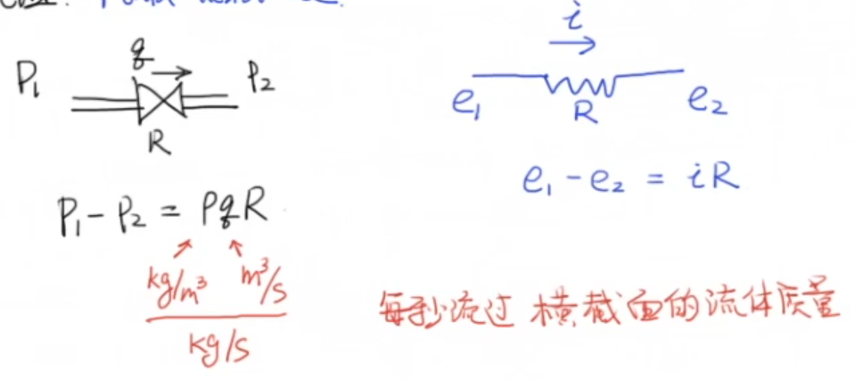
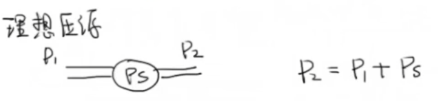
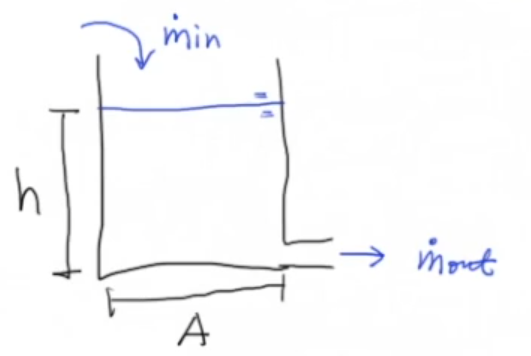

> 考虑的是均质不可压缩的流体，密度$\rho$为常数。

| 名称  | 字母缩写 |   英文    |  单位   |
| :---: | :------: | :-------: | :-----: |
| 流量  |   $q$    | flow rate | $m^3/s$ |
| 体积  |   $V$    |  volume   |  $m^3$  |
| 高度  |   $h$    |  height   |   $m$   |
| 压强  |   $P$    | pressure  | $N/m^2$ |

> 面积为$A$，单位$m^2$。

- 静压(Hydrostatic Pressure)：$P_{Hydro} = \frac{F_{Hydro}}A = \frac{mg}A = \rho gh$
- 绝对压强(Absolute Pressure)：$P_{abs} = P_a + P_{Hydro} = P_a + \rho gh$
- 表压(Gauge Pressure)：$P_{gauge} = P_{abs} - P_a = \rho gh$

#### 流阻(Fluid Resistance)

#### 理想压源

#### 质量守恒(conservation of mass)

根据流体质量守恒定律，我们有
$$
\begin{aligned}
    &\frac{dm}{dt} = m_{in} - m_{out}\\
    \Rightarrow ~& \frac{dV}{dt} = q_{in} - q_{out}\\
    \Rightarrow ~& \frac{dh}{dt} = \frac1A(q_{in} - q_{out})\\
\end{aligned}
$$

把以上结果带入进公式$P= P_a + \rho gh$，得
$$
\frac{dP}{dt} = \frac{\rho g}{A}(q_{in} - q_{out})
$$