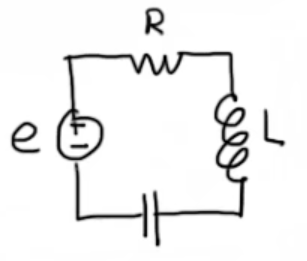

## 拉氏变换(Laplace Transform)
将时域上的$f(t)$变换到复数域上$F(s)$，简便计算。
对于函数$f(t)$，我们称
$$
\mathcal{L}[f(t)] = \int_{0}^{\infty}f(t) e^{-st}\mathrm{dt} = F(s)
$$
为**Laplace Transform**，其中$s = \delta + j \omega,j = \sqrt{-1}$。

#### 例1
对于函数$f(t) = e^{-at}$，
$$
\mathcal{L}[f(t)] = \frac1{s+a}
$$

#### 例2
对于函数$f(t) = \sin(at)$，
$$
\mathcal{L}[f(t)] = \frac{a}{s^2+a^2}
$$
其中将三角函数写成复数的形式，再用Laplace Transform的线性性质。

#### 例3
$$
\mathcal{L}[f'(t)] = sF(s) - f(0)
$$
$$
\mathcal{L}[f''(t)] = s^2F(s) - sf(0) - f'(0)
$$
一般定义$f(0) = 0$。

#### 例4
$$
\mathcal{L}[\int_{0}^{t}f(t)\mathrm{dt}] = \frac1sF(s)
$$

#### 例5（卷积）
$$
\mathcal{L}[f(t)*g(t)] = F(s)G(s)
$$

---
对于一个一般的电路系统（如图），

我们有
$$
e' = Li'' + Ri' + \frac1C i
$$
进行Laplace Transform，得
$$
sE(s) = Ls^2I(s) + RsI(s) + \frac1CI(s)
$$